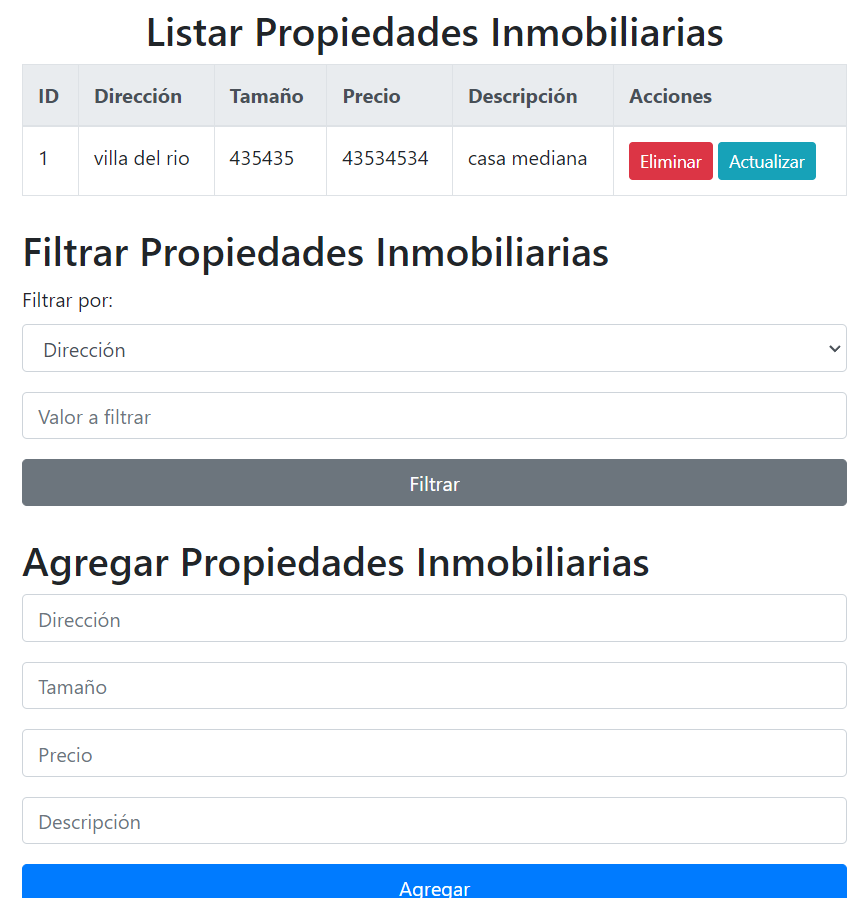
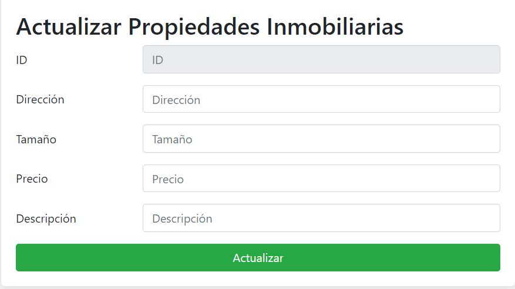
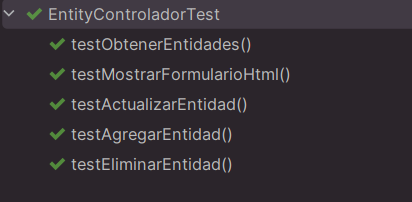

# TALLER  SISTEMA CRUD PARA GESTIONAR PROPIEDADES

En este taller se elaboró una aplicación para gestionar propiedades inmobiliarias implementando un sistema CRUD para crear, listar, actualizar y eliminar dichas "entidades". Para su despliegue, se configuraron dos instancias EC2 en AWS. La primera instancia aloja el componente de Spring, que incluye tanto el backend como el frontend. Esta instancia se comunica con la segunda, donde está implementada la base de datos MySQL, logrando así una arquitectura distribuida. Adicionalmente, se realizaron las validaciones de campos, los respectivos filtros por precio, tamaño y dirección y los mensajes para el usuario de exito o error de las operaciones del CRUD.   

## Arquitectura

1. **Componente Spring (Backend + Frontend):**
   - El frontend está integrado en el mismo servidor que el backend y se comunica directamente con los controladores y servicios REST expuestos por el backend de Spring.
   - El backend, además de servir el frontend, maneja la lógica de negocio para realizar las operaciones CRUD, gestiona peticiones HTTP y usa los datos provenientes de la base de datos. Además, se utilizó el patrón de diseño arquitectónico **Modelo-Vista-Controlador**
2. **Componente MySQL (Base de datos):** 
   - Este componente es la base de datos MySQL implementado en un servidor diferente.
     El componente Spring se comunica con MySQL a través de una conexión de red utilizando Spring Data JPA para realizar operaciones de lectura y escritura en la base de datos.
## Empezando

### Requisitos Previos
Para ejecutar este proyecto, necesitarás tener instalado:

- Java JDK 17.
- Un IDE de Java como IntelliJ IDEA, Eclipse, o NetBeans.
- Maven para manejar las dependencias preferiblemente la version 3.9.4 
- Un navegador web para interactuar con el servidor.

### Instalación

1. Tener instalado Git en tu máquina local
2. Elegir una carpeta en donde guardes tu proyecto
3. abrir la terminal de GIT --> mediante el click derecho seleccionas Git bash here
4. Clona el repositorio en tu máquina local:
   ```bash
   git clone https://github.com/Medina95/Taller-CRUD-AREP.git
   ```
5. **IMPORTANTE**: 
   - En application.properties tiene que cambiar el usuario en ***spring.datasource.username*** por root o por un usuario que tenga predefinido.
   - En **spring.datasource.password** cambié la contraseña por su contraseña de base de datos.
   - Finalmente, cambie su IP en **spring.datasource.url** por localhost o una específica como las de AWS y no olvide que la base se llama arep. 
   - 

## Deployment
1. Abre los dos proyectos con tu IDE favorito o navega hasta el directorio del proyecto
2. Desde la terminal para compilar y empaquetar el proyecto ejecuta:

   ```bash
   mvn clean install
   ```
3.  Compila el proyecto que contiene el método MAIN: AccessingDataJpaApplication o ejecuta desde la terminal

   ```bash
   mvn spring-boot:run
   ```
Verá que el servidor está listo y corriendo sobre el puerto 8080

4. Puedes interactuar con los endpoints RESTful API con:
    - http://localhost:8080/agregar
    
    - 
    - 


   
## Despliegue en AWS

- **Video**: 
[despliegue en AWS funcionando](https://drive.google.com/file/d/1ll3aPTMM3jSG-ICfOvjnJYcw2ehXw-0N/view?usp=sharing)


## Ejecutar las pruebas

El proyecto incluye pruebas unitarias que simulan el comportamiento del servicio y del controlador: 
1. Desde la terminal ejecutas:
   ```bash
   mvn test
   ```
### Desglosar en pruebas de extremo a extremo
- **testMostrarFormularioHtml**: Prueba para verificar la visualización del formulario.
- **testAgregarEntidad**: Prueba para agregar una nueva entidad. Simula la creación de una entidad y se verifica que se redirige correctamente y que se llama al servicio para agregar la entidad y verifica si guardo los valores esperados.
- **testObtenerEntidades**: Prueba para obtener todas las entidades en formato JSON. Se simula la obtención de una lista de entidades y se verifica que se retornen el número correcto de entidades.
- **testEliminarEntidad** Prueba para eliminar una entidad por ID. Se espera que la respuesta sea 200 OK tras la eliminación y se verifica que se llama al servicio para eliminar la entidad.
- **testActualizarEntidad**:Prueba para actualizar una entidad existente. Se simula que el servicio devuelve la entidad existente, se actualiza la entidad y se verifica que la entidad devuelta

### Ejemplo
 ```bash
    @Test
    public void testAgregarEntidad() {
        EntityDatos entidad = new EntityDatos("villa del río", 100, 1000000, "casa amoblada");

        // Verifica la redirección tras agregar la entidad.
        String redirect = entityControlador.agregarEntidad(entidad);
        assertEquals("redirect:/agregar", redirect);

        // Captura la entidad que se pasó al servicio.
        ArgumentCaptor<EntityDatos> entityCaptor = ArgumentCaptor.forClass(EntityDatos.class);
        verify(entityService).AgregarEntidad(entityCaptor.capture());

        // Verifica que la entidad capturada tiene los valores esperados.
        EntityDatos entidadCapturada = entityCaptor.getValue();
        assertEquals("villa del río", entidadCapturada.getAddress());
        assertEquals(100, entidadCapturada.getSize());
        assertEquals(1000000, entidadCapturada.getPrice());
        assertEquals("casa amoblada", entidadCapturada.getDescription());
    }
      
   ```



## Built With
* [Maven](https://maven.apache.org/) - Dependency Management

## Authors

* **Carolina Medina Acero** - [Medina95](https://github.com/Medina95)
